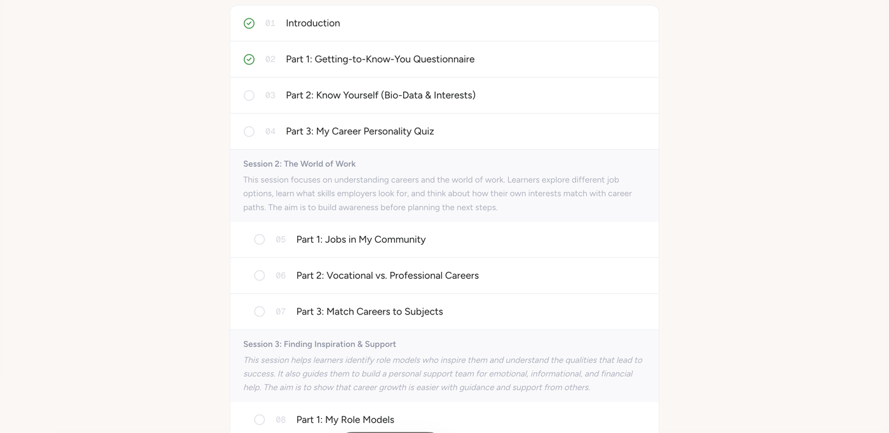
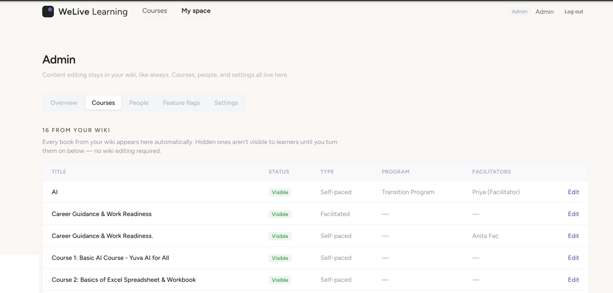
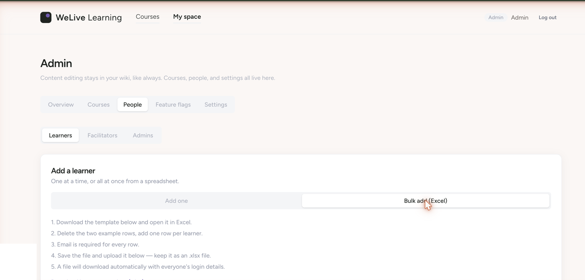
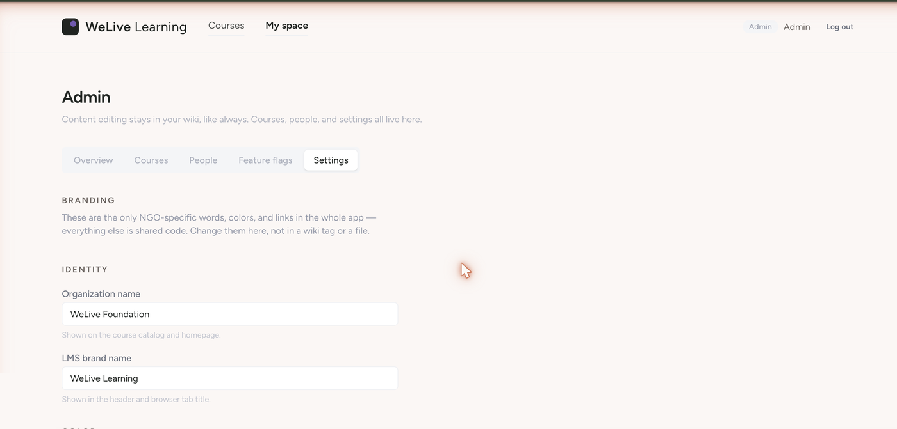

# Stackwise

**Turn a [BookStack](https://www.bookstackapp.com) wiki into a full learning management system — no content migration, no new place to write.**

If your organization already keeps its training material, guides, or handbooks in BookStack, Stackwise adds everything a wiki doesn't have: learner accounts, enrollment, progress tracking, roles, and a course catalog — all reading live from the wiki you already maintain.

## How it works

Stackwise doesn't copy your content anywhere. It reads your BookStack instance through its API and maps its structure directly onto a course:

| BookStack | Stackwise |
|---|---|
| A **book** | A course |
| A **chapter** | A session/module inside that course |
| A **page** | A lesson learners read and mark complete |

Edit a page in BookStack, save it, and the change shows up for learners immediately. Nothing about how your wiki works has to change — Stackwise is a layer on top, not a replacement.

## Features

### A catalog and syllabus that understand structure

Courses show learners a real syllabus — sessions grouped with their own intro text (pulled from BookStack's own chapter descriptions), not just a flat list of pages.

### Plain-language admin, zero wiki editing required

Every book in your wiki shows up automatically. An admin decides what's visible, what type of course it is (self-paced, facilitated, or an external link), which program it belongs to, and who facilitates it — all from a normal settings screen, never a wiki tag.

### Roles built for how training actually runs

- **Admins** manage the whole catalog, every account, and org settings.
- **Facilitators** manage the roster for courses they're assigned to.
- **Learners** enroll (if you allow self-enrollment) or get assigned, and track their own progress.

Enrolling someone always searches the existing learner registry first, so the same person never ends up as two accounts just because a facilitator didn't know they'd already signed up.

### Bulk-add people from Excel

For onboarding a whole cohort at once: download a template, fill it in, upload it. Stackwise creates every account, generates passwords, and hands back a results file — no CSV wrangling, no command line.

### Offline workbooks

Any course (or a single session within it) can be downloaded as a `.docx` — useful for printing, facilitator-led sessions, or anywhere internet access can't be assumed.

### Fully rebrandable — because it's meant to be redeployed

Stackwise isn't built as one app for one organization. Every org-specific detail — name, brand name, accent color, hero copy, logo, favicon, and extra nav/footer links — lives in the database and is edited from Settings. There is nothing to fork, rename, or hardcode to stand up a new instance for a different organization.

### Feature flags for what you don't need yet

Self-enrollment, public catalog access, open registration, optional email for accounts, facilitator assignment, cohorts, certificates — all toggleable per organization without touching code.

## Tech stack

- [Next.js 16](https://nextjs.org) (App Router) + React 19
- [Prisma 7](https://www.prisma.io) — SQLite in development, Postgres in production
- [Auth.js](https://authjs.dev) (NextAuth v5) for credentials-based login
- [Tailwind CSS v4](https://tailwindcss.com)
- BookStack REST API for content, tags, and webhooks
- [@turbodocx/html-to-docx](https://github.com/TurboDocx/html-to-docx) for `.docx` workbook exports

## Getting started

Stackwise needs a running BookStack instance with an API token, a database, and a few environment variables. Full setup — from `npm install` through a production VPS deploy with pm2 and nginx — is in **[DEPLOY.md](DEPLOY.md)**.

## License

[MIT](LICENSE)
